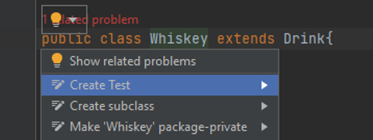
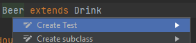
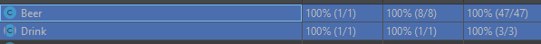

# Konf_B20_Lehner_Menzinger

## Changelog

### Christoph Menzinger:

#### Description: 

##### Task 1:
- extends new class "Whiskey.java" extends from Drink.java

- initialization of age, region and bottling of Whiskey.java

- implement new getter and setter of Whiskey.java

- create Whisky Jameson in main

- definition of the new whiskey in new main

- print information of the new whiskey "Jameson"

##### Task 2:

###### Change pom.xml for JUnit Test
- copied the pom.xml from the calculator example

###### Create new method in whiskey (dilute) 
- **to change the alcohol**
- the parameters of the method are a amount of alcohol and a amount of water
- the water gets divide by two
- then the alc gets subtract by water
- the method returns the new amount of alcohol
  ```java
    public int dilute(int alc, int water){}
  ````
###### Create the "test" folder" 
- in maven-standard

###### Create my Test class
  ```java
     class WhiskeyTest{}
  ```
  
- create/declare all tests !
- init the ``` @BeforeEach```
  method for working with the same constructed object
- declare all test-methods 
- for my ```
          void testDilute(){} 
          ```
  i pre-calculated some tasks which i have passed the ``` @ParameterizedTest```
- init all tests an reached the 100% (**14 Tests**)

###### Used Sources:

[makeareadme](https://www.makeareadme.com "first steps in Docs")
 
[Markdown tutorial](https://www.youtube.com/watch?v=6A5EpqqDOdk "practical use")


### Robert Lehner

#### Task 1

- extends Drink.java with Beer.java

- initialization of super methods with override

- added javadoc informations 

- added a new Method 

- ```java
  public String[] commonBrands(String country [AT|DE]) throws Exception [if country is not from list]
      returns primitive String Array with the 10 most common brands
  ```

- added file header

- fixed bug in Beer.java isCommonIn - before "AT" was used instead of the parameter

- implemented in Main.java with output of the main facts

#### Task 2
- As jDoc was implemented last time, for this task only a changed method was updated
- Adapted ``` Beer.isCommonIn()``` to throw a Exception in the catch block, in order to can test the catch block.
- Added test cases for each method and all possible return values
  - Pro Tipp: IntelliJ creates test cases by clicking right on the class name 
- ```@BeforeEach``` creates 4 objects to test all possible constructors
-  Reached 100% in Class, Method and Line
- Explanation of why I did not achieve 100% is omitted because I did it.

### JavaDoc for Dummies
1. Use ```/**``` instead of ```/*``` - most IDEs then generate JavaDoc automatically
2. Most common Tags:
    - ```@author``` (classes and interfaces) defines the author
    - ```@version``` (classes and interfaces) defines the version
    - ```@param``` (methods and constructors) explains a parameter
    - ```@return``` (methods) explains the return value
    - ```@exception``` equals ```@throws``` explains a possibly thrown exception
    - ```@see``` adds a reference
3. Use all the tags provided above in the order as above at the places stated above
4. Be happy about a good documentation
5. Used literature: https://www.oracle.com/technical-resources/articles/java/javadoc-tool.html#terminology


###### Used sources

- Years of experience through training with recognised alcoholics
- https://www.makeareadme.com/
- https://www.markdownguide.org/cheat-sheet
- Expiences of former projects
